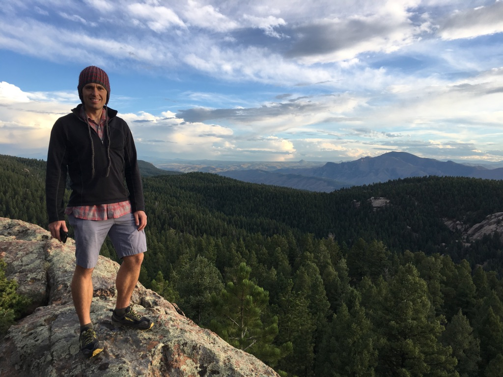

I am a postdoctoral fellow in the Department of Mathematics at Colorado State University where I work with the [Pattern Analysis Lab](https://sites.google.com/a/rams.colostate.edu/pattern-analysis-lab/). I graduated with a PhD in mathematics from UC Davis in June 2017. My advisor was [Monica Vazirani](https://www.math.ucdavis.edu/~vazirani/).

As a graduate student I worked on problems related to representation theory, algebraic combinatorics, and categorification. I still do work on these subjects but I now also work on problems related to geometric data analysis and machine learning. 
My [CV](HKvingeCV.pdf)

