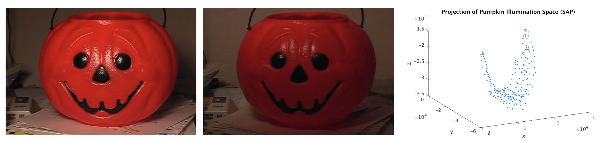
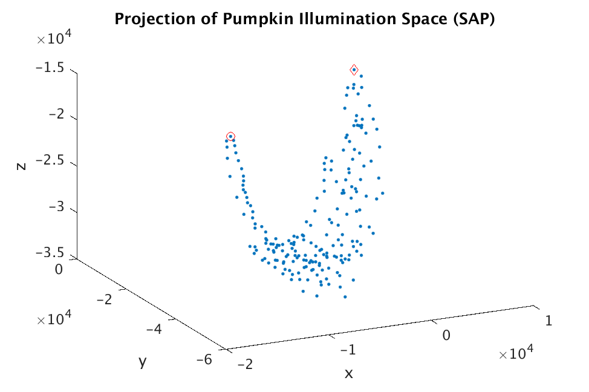
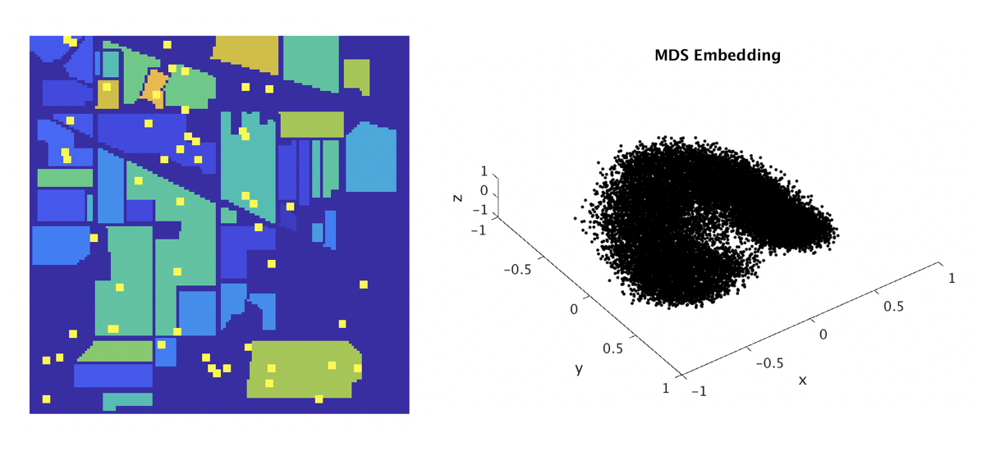

I am interested in geometric and topological data analysis, machine learning, compressive sensing, and applied optimization. More generally I like developing techniques that extract the maximum amount of information from high-dimensional, complicated data sets. 

My papers include:

3. **Too many secants: Too many secants: a hierarchical approach to secant-based dimensionality reduction on large data sets** (with Elin Farnell, Michael Kirby, and Chris Peterson) accepted to IEEE High Performance Extreme Computing Conference September 2018 (link coming soon).

<!--
|  |
|:--:|
| *Right: The projection (using the SAP algorithm from the paper above) of a collection of points corresponding to images of a plastic pumpkin with various illuminations, to 3-dimensions. (Left and middle) The images corresponding to the two extreme points circled in red. The parabola traced out by the data in 3-dimensions corresponds to changes in illumination as the light source smoothly changes position.* | 
__>

2. **A GPU-oriented algorithm design for secant-based dimensionality reduction** (with Elin Farnell, Michael Kirby, and Chris Peterson) to appear in the Proceedings of the 17th IEEE International Symposium on Parallel and Distributed Computing. [ArXiv version](https://arxiv.org/abs/1807.03425)

|  |
|:--:|
| *The projection (using the SAP algorithm from the paper above) of a collection of points corresponding to images of a plastic pumpkin with various illuminations, to 3-dimensions. The parabola traced out by the data in 3-dimensions corresponds to changes in illumination as the light source smoothly changes position.* |

| 
|:--:| 
| *The images corresponding to the two extreme points circled in red.* |

1. **Endmember extraction on the Grassmannian** (with Elin Farnell, Michael Kirby, and Chris Peterson) to appear in the Proceedings of the 2018 IEEE Data Science Workshop. [ArXiv version](https://arxiv.org/abs/1807.01401)

|  |
|:--:|
| *Right: (Left) Ground truth labels for the Indian Pines dataset. The yellow dots indicate points that our algorithm identified as endmembers of the image. In other words, the yellow points would correspond to extreme points in the image of the MDS mapping of subspaces spanned by spectral curves in the Grassmann manifold G(9,200) to Euclidean space (a projection down to 3-dimensional Euclidean space is shown at right).* | 

In progress:

1. **Using dictionary learning to predict health outcomes** (with Elin Farnell, Michael Kirby, and Chris Peterson).
