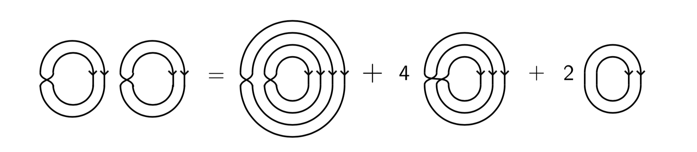

## Data science and machine learning

I am interested in machine learning. In particular, the use of tools from pure mathematics to enable new frameworks, algorithmic architectures, and general approaches to machine learning prroblems. I am especially interested in:

* Geometric deep learning, 
* Few-shot learning,
* Computer vision
* Applications of representation to machine learning
* The use of sheaves and other topological constructions in machine learning,
* Compressive sensing, 
* Dimensionality reduction,
* The use Grassmann and related manifolds as frameworks for machine learning problems.

See my [publications page](publications.md) for a list of my papers. 

## Representation theory and combinatorics

I used to work on problems related to representation theory, algebraic Lie theory, algebraic combinatorics, and categorification:

See my [publications page](publications.md) for a list of my papers.

My representation theory oriented [research statement](Rep-theory_research_statement.pdf)

Selected presentation slides:

1. [Heisenberg categories, towers of algebras, and up/down transition functions](UVA2018Kvinge.pdf) for Workshop in representation theory, combinatorics, and geometry, October 2018.

2. [Khovanov's Heisenberg category, moments in free probability, and shifted symmetric functions](UVApresentation2017.pdf) for University of Virginia Algebra Seminar, 2017,

3. [The Kirillov-Reshetikhin crystal B^{1,1} and cyclotomic quiver Hecke algebras](CUBoulder2017.pdf) for University of Colorado Algebraic Lie Theory Seminar, 2017.

